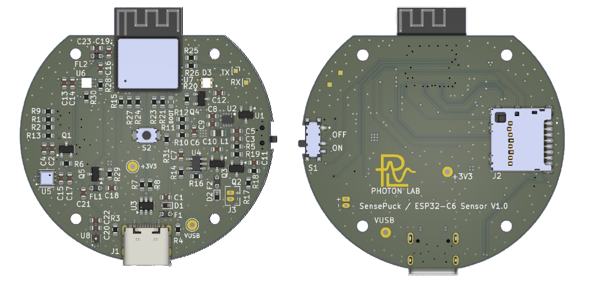
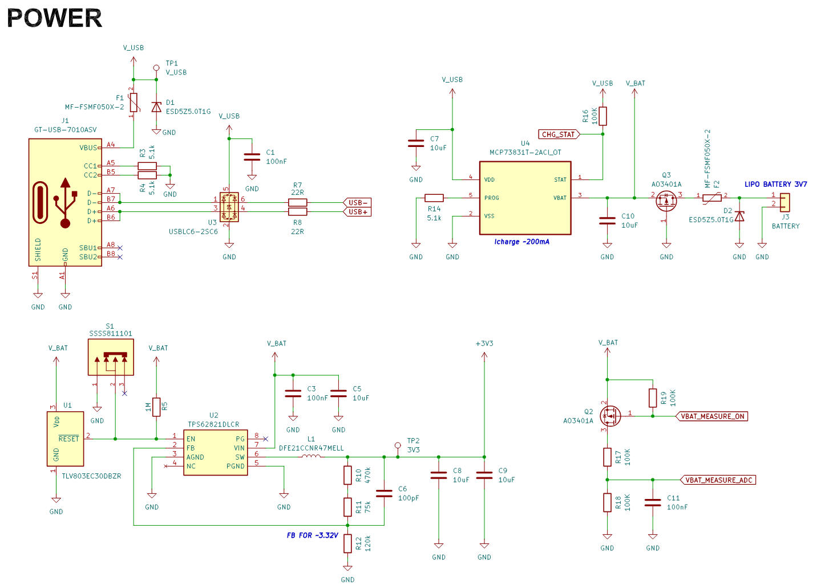
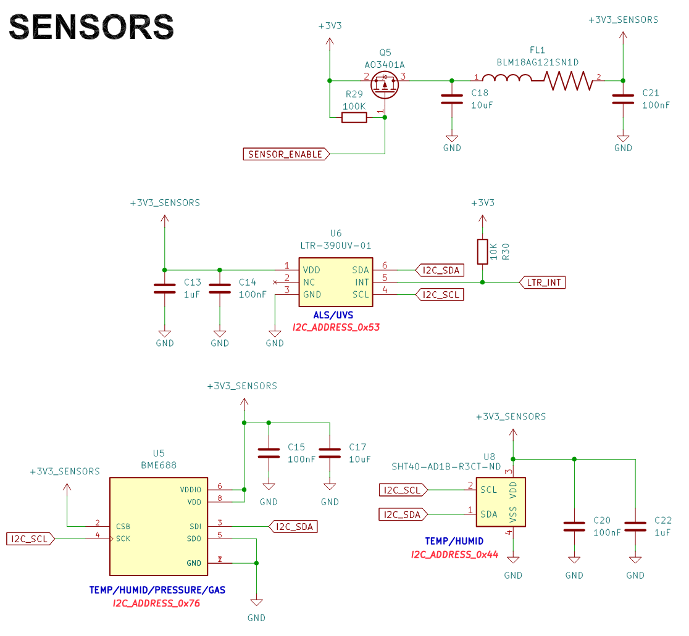
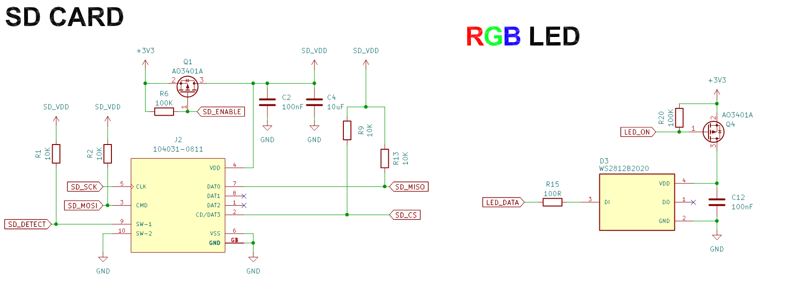
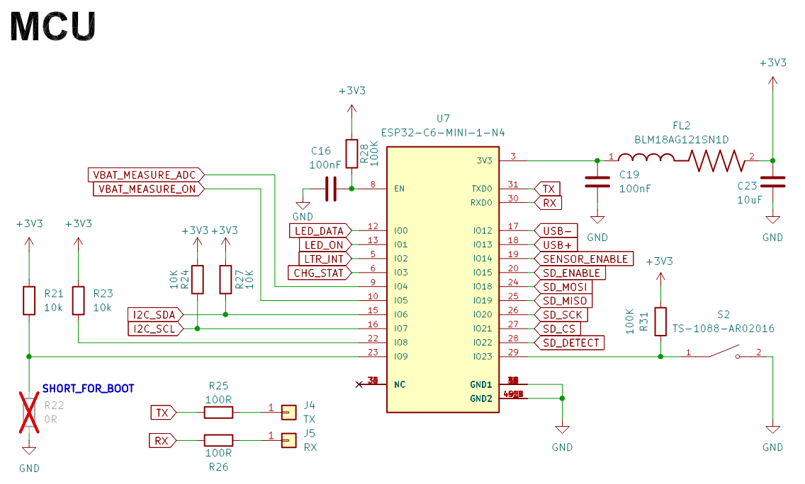

# SensePuck / ESP32-C6 Sensor Board

**SensePuck is a compact, open-source environmental sensor board built around the ESP32-C6.** It's designed for a wide range of applications, from personal weather stations and air quality monitors to IoT data-logging projects.

---

## Key Features

-   **MCU:** **ESP32-C6-MINI-1-N4** providing Wi-Fi 6, Bluetooth 5 (LE), Zigbee, and Thread connectivity.
-   **Comprehensive Environmental Sensing:**
    -   **BME688:** Measures temperature, humidity, barometric pressure, and gas (Volatile Organic Compounds - VOCs).
    -   **SHT40:** High-accuracy secondary sensor for temperature and humidity.
    -   **LTR-390UV-01:** Measures both ambient light and UVA/UVB (UV Index).
-   **Flexible Power Management:**
    -   **USB-C** for charging and programming.
    -   **LiPo Battery Charger** (MCP73831T).
    -   High-efficiency **3.3V Buck Converter** (TPS62821DLCR).
    -   Physical **On/Off Power Switch**.
-   **Onboard Data Storage:** **MicroSD card slot**.
-   **User Interface:**
    -   **WS2812B "NeoPixel" RGB LED** for status indication.
    -   **User-programmable tactile button**.
-   **Developer Friendly:**
    -   ESP32 Native USB connection for easy programming.
    -   Dedicated pins for initial bring-up (BOOT button) and UART (TX/RX) for debuging.

---

## Hardware Details

The SensePuck is designed with low-power operation as a primary goal, making it ideal for long-term battery-powered deployments. This is achieved through a combination of a high-efficiency power supply, aggressive power gating of all major peripherals, and measurement circuits.

### Power Supply and Battery Management

The power section is designed for efficiency, reliability, and safety in long-term battery-powered applications.

*   **Power Source:** The board is designed to be powered by a standard 3.7V single-cell LiPo battery. For development and charging, it uses a **USB-C connector (J1)**. The USB input is protected by a **resettable fuse (F1)** and **ESD protection diodes (U3, D1)** to guard against overcurrent and electrical discharge events.

*   **Battery Charging:** The **MCP73831T (U4)** is a dedicated LiPo/Li-Ion charge management controller IC that provides safe and reliable single-cell charging. The charge current is set to ~200mA via resistor **R14**, a conservative value suitable for a wide range of small LiPo batteries. The MCU can monitor the charging state (`Charging`/`Done`) via the `CHG_STAT` pin.

*   **Voltage Regulation:** The core of the power supply is the **TPS62821DLCR (U2)**, a high-efficiency synchronous buck (step-down) converter. It takes the variable battery voltage and generates a stable 3.3V supply for the ESP32 and all peripherals. It offers an **extremely low quiescent current**, which is the tiny amount of power it consumes just by being on. This is critical for achieving multi-week or multi-month battery life when the ESP32 is in deep sleep.

*   **The Hardware Failsafe - Critical for Reliability:** A common failure point in battery-powered devices is unstable operation when the battery voltage drops. As the battery voltage falls below 3.3V, a standard buck converter enters "dropout mode," where it can no longer regulate, and the output voltage sags along with the battery. This can cause the ESP32 to enter a "brownout" state, leading to unpredictable resets, corrupted data on the SD card, or a boot-loop that quickly kills the battery.

    To prevent this, SensePuck incorporates a **TLV803EC30DBZR (U1) voltage supervisor**.
    *   It **independently** monitors the battery voltage, completely separate from the MCU.
    *   If the voltage drops below its fixed threshold of ~2.93V, the supervisor **immediately and automatically disables the buck converter** by pulling its `EN` (Enable) pin low.
    *   This forces a **clean, hard shutdown**, preventing the entire system from operating with an unstable power supply. It also serves as the main protection against over-discharging and permanently damaging the battery, even if the main firmware has crashed.

This hardware-based approach is more reliable than a software-only voltage check, which cannot prevent brownouts caused by sudden current spikes (e.g., Wi-Fi activation) or protect the battery if the software hangs.

---

### Power Gating

To achieve the lowest possible sleep current, all peripherals are completely powered off. The SensePuck uses P-Channel MOSFETs as high-side switches to disconnect power from entire circuit sections.

#### Sensor Power Control

The BME688, SHT40, and LTR-390UV sensors, while low-power, still have a quiescent current draw that would drain the battery over weeks.

*   **The Switch:** A single **P-Channel MOSFET (Q5)** controls the power rail (`+3V3_SENSORS`) for all three sensors.
*   **The Control:** The MCU's `SENSOR_ENABLE` GPIO pin controls this MOSFET.
    *   When the MCU needs to take a reading, it pulls `SENSOR_ENABLE` **LOW**. This turns the MOSFET ON, supplying power to the sensors.
    *   After the reading is complete, the MCU sets `SENSOR_ENABLE` **HIGH**. This turns the MOSFET OFF, completely cutting power to the sensors and eliminating their idle current draw.
*   **Clean Power:** A **ferrite bead (FL1)** and capacitors create a pi filter which provides extra filtering to ensure the sensors receive clean power when they are enabled, which is important for accurate measurements.

#### SD Card and RGB LED Power Control

This same power-gating principle is applied to the other major peripherals:

*   **SD Card:** MicroSD cards can consume significant current, even when idle. **MOSFET Q1**, controlled by the `SD_ENABLE` pin, allows the firmware to completely power down the SD card between read/write operations.
*   **RGB LED:** Even the small quiescent current of the **WS2812B2020 LED (D3)** is eliminated. **MOSFET Q4**, controlled by the `LED_ON` pin, ensures the LED only receives power when it is actively being used for status indication.

---

### MCU and Measurement Circuits

*   **ESP32-C6 Core:** The ESP32-C6 is the brain of the board. Its primary low-power feature is its deep sleep mode, where the main cores and most peripherals are shut down, allowing the chip to run on mere microamps of current while waiting for a timer or external trigger to wake up.
*   **Power-Gated Battery Measurement:** Measuring the battery level without constantly draining it is a common challenge. SensePuck solves this with an intelligent circuit:
    1.  A voltage divider (**R17** and **R18**) is used to scale the battery voltage down to a level that is safe for the ESP32's ADC.
    2.  Crucially, this divider is **not** permanently connected to the battery. A **MOSFET (Q2)** acts as a switch at the top of the divider.
    3.  To check the battery, the firmware momentarily pulls the `VBAT_MEASURE_ON` pin low, which turns on Q2, completes the circuit, and allows for an ADC reading. It then immediately turns Q2 off.
    4.  This ensures the voltage divider only draws current for the few milliseconds required to take a measurement, making the process extremely energy efficient.

### Component Overview

This table provides a quick reference for the key components on the SensePuck board.

| Reference | Component               | Description                                                                    | I2C Address |
| :-------- | :---------------------- | :----------------------------------------------------------------------------- | :---------- |
| U7        | ESP32-C6-MINI-1-N4      | Main Microcontroller with Wi-Fi 6, BT5, Zigbee, Thread                         | -           |
| U5        | BME688                  | Temperature, Humidity, Pressure & Gas (VOC) Sensor                             | `0x76`      |
| U8        | SHT40-AD1B-R3CT-ND      | High-Precision Temperature & Humidity Sensor                                   | `0x44`      |
| U6        | LTR-390UV-01            | Ambient Light & UV Sensor                                                      | `0x53`      |
| U4        | MCP73831T-2ACI_OT       | Li-Ion/Li-Polymer Battery Charge Management Controller                         | -           |
| U2        | TPS62821DLCR            | High-Efficiency 3.3V Step-Down Converter                                       | -           |
| J2        | 104031-0811             | MicroSD Card Socket                                                            | -           |
| D3        | WS2812B2020             | Addressable RGB LED for status indication                                      | -           |

## Firmware

**Coming Soon!**

The firmware for the SensePuck is currently under development. It will be built using the ESP-IDF framework for complete control of the MCUs peripherals to ensure ultra-low power operation.

This board is also compatible with . YAML Configuration will be provided soon.

---

## License

This project is open source hardware, licensed under the **CERN Open Hardware Licence Version 2 - Permissive (CERN-OHL-P v2)**.

You are welcome to use, modify, manufacture, and distribute this hardware design, provided you give credit to the original author and include the original copyright and license notice. For the full license details, please see the [LICENSE](LICENSE) file included in this repository.

A `NOTICE` file with licensor and project details is also included, as required by the license.
