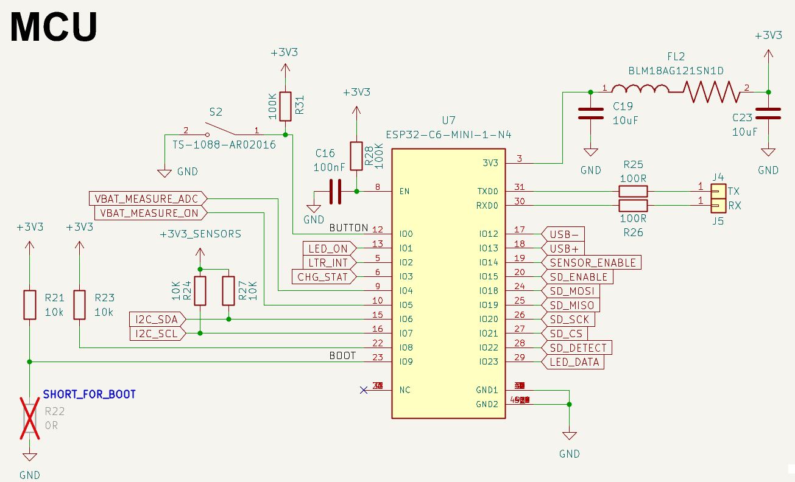

# SensePuck V0.3 / ESP32-C6 Sensor Board

  ### ⚠️ **This project is under active development. Expect changes.**

**SensePuck is a portable, open-hardware data logger designed for long-term, battery-powered environmental monitoring.** It integrates a powerful ESP32-C6 SoC with a suite of precision sensors, flexible power management, and local data storage, making it a robust platform for applications ranging from remote weather stations to indoor air quality analysis and IoT research.

---

## Key Specifications

| Category | Component / Specification |
| :--- | :--- |
| **MCU** | Espressif ESP32-C6-MINI-1-N4 |
| **Connectivity** | Wi-Fi 6 (802.11ax), Bluetooth 5.3 LE, Zigbee, Thread (802.15.4) |
| **Sensors** | **BME688:** Gas (VOC), Pressure, Humidity, Temperature **SHT40:** High-Accuracy Humidity & Temperature **LTR-390UV:** Ambient Light & UV Index (UVA/UVB) |
| **Power Input** | USB Type-C (Charging & Programming) JST-PH 2-pin connector for 3.7V Single-Cell (1S) LiPo/Li-Ion Battery |
| **Storage** | MicroSD Card Slot with Card Detect |
| **User Interface** | WS2812B-2020 Addressable RGB LED Tactile Push Button (User Input) |

---

## Hardware Details

The core design objective of the SensePuck is to achieve maximum operational endurance from a compact LiPo battery. This is accomplished through a multi-faceted approach:
1.  **Component Selection:** Every critical component was chosen for its ultra-low quiescent current and high efficiency.
2.  **Aggressive Power Gating:** All non-essential peripherals are completely disconnected from the power rails during sleep states using MOSFET-based load switches.
3.  **Hardware-Level Failsafes:** A dedicated voltage supervisor provides robust protection against battery over-discharge and brownout conditions, independent of the main MCU's state.

---

## Power Supply and Battery Management

The power section is designed for efficiency, reliability, and safety in long-term battery-powered applications.

*   **Power Source:** The board is designed to be powered by a standard 3.7V single-cell LiPo battery. A physical **slide switch (S1)** serves as the master On/Off control by controlling the `ENABLE` pin of the TPS62821DLCR buck converter. For development and charging, it uses a **USB-C connector (J1)**. The USB input is protected by a **resettable fuse (F1)** and **ESD protection diodes (U3, D1)** to guard against overcurrent and electrical discharge events.

*   **Battery Charging:** The **MCP73831T (U4)** is a dedicated LiPo/Li-Ion charge management controller IC that provides reliable single-cell charging. The charge current is set to ~200mA via resistor **R14**, a conservative value suitable for a wide range of small LiPo batteries. A P-Channel MOSFET **(Q3)** provides reverse-polarity protection for the battery. The MCU can monitor the charging state (`Charging`/`Done`) via the `CHG_STAT` pin.

*   **Voltage Regulation:**
    *   **Component:** The system's 3.3V rail is generated by the **Texas Instruments TPS62821DLCR (U2)**. This synchronous buck converter was chosen specifically for its **60 nA quiescent current (Iq)**. An LDO was avoided due to the significant efficiency loss when converting from a 4.2V-3.3V LiPo source. The TPS62821's high efficiency (>90% across a wide load range) and ultra-low Iq are paramount for maximizing battery life during the long deep-sleep periods that dominate the device's operational time.
    *   **Implementation:** The feedback network (**R10+R11, R12**) sets the stable 3.3V output. The converter is enabled or disabled via its `EN` pin, allowing for a complete system shutdown.

*   **Hardware Failsafe:** A common failure point in battery-powered devices is unstable operation when the battery voltage drops. As the battery voltage falls below 3.3V, a standard buck converter enters "dropout mode," where it can no longer regulate, and the output voltage sags along with the battery. This can cause the ESP32 to enter a "brownout" state, leading to unpredictable resets, corrupted data on the SD card, or a boot-loop that quickly kills the battery.

    To prevent this, SensePuck incorporates a **TLV803EC30DBZR (U1) voltage supervisor**.
    *   It **independently** monitors the battery voltage, completely separate from the MCU, and consumes only ~0.4µA.
    *   If the voltage drops below its fixed threshold of ~3V, the supervisor **immediately and automatically disables the buck converter** by pulling its `EN` (Enable) pin low.
    *   This forces a **clean, hard shutdown**, preventing the entire system from operating with an unstable power supply. It also serves as the main protection against over-discharging and permanently damaging the battery, even if the main firmware has crashed.

This hardware-based approach is more reliable than a software-only voltage check, which cannot prevent brownouts caused by sudden current spikes (e.g., Wi-Fi activation) or protect the battery if the software hangs.

---

## Power Gating

To minimize deep-sleep current, high-side switching using low Rds(on) P-Channel MOSFETs (**AO3401A**) is employed to completely disconnect peripherals from their power source. This strategy reduces the sleep current from hundreds of µA (if peripherals were left in standby) to the single-digit µA range, dominated only by the leakage of the core components.

---

## Sensor Power Control

The BME688, SHT40, and LTR-390UV are gated by a single MOSFET **(Q5)**, controlled by `SENSOR_ENABLE`. The firmware brings this pin `LOW` only for the duration of a measurement, powering the entire sensor suite. Once measurements are complete, the pin is driven `HIGH`, turning off the MOSFET and eliminating all quiescent current from the sensors. A pi filter composed of a **ferrite bead (FL1)** and capacitors is placed on this switched rail to provide clean, stable power to the sensitive analog front-ends of the sensors, ensuring measurement accuracy.

---

## SD Card and RGB LED Power Control

This same power-gating principle is applied to the other major peripherals:

*   **SD Card (Q1):** MicroSD cards can have an idle current draw of over 100µA. MOSFET **Q1**, controlled by `SD_ENABLE`, ensures the card is only powered when a file operation is active. The `SD_DETECT` switch in the socket allows the firmware to avoid powering the rail if no card is present.
*   **RGB LED (Q4):** The **WS2812B2020 LED (D3)** also has a small quiescent draw. MOSFET **Q4**, controlled by `LED_ON`, ensures it draws zero current when not in use. A 100-ohm series resistor (**R15**) on the data line serves as a protective measure and helps match impedance, improving signal integrity.

---

## MCU and Measurement Circuits

*   **MCU (U7):** The ESP32-C6-MINI-1 was selected for its blend of modern connectivity (Wi-Fi 6), low-power modes (deep-sleep with LP core), and native USB for simplified programming. Its power input is isolated with its own ferrite bead filter **(FL2)** to reduce noise from the rest of the system.
*   **Power-Gated Battery Measurement:** A simple resistive divider for measuring battery voltage would constantly drain the battery. To solve this, the divider (**R17, R18**) is gated by MOSFET **Q2**. To perform a measurement, the firmware executes a "sample-and-hold" logic:
    1.  Drive `VBAT_MEASURE_ON` pin `LOW`.
    2.  This activates Q2, connecting the divider to the battery rail.
    3.  A brief delay allows the voltage at the ADC pin to stabilize.
    4.  The ADC is triggered to take a sample.
    5.  `VBAT_MEASURE_ON` is immediately driven `HIGH`, deactivating Q2.
    This entire process takes only a few milliseconds, and the divider only draws current during this tiny window, making the energy cost of voltage measurement negligible.

## Component & Pinout Overview

### Key Components

| Reference | Component               | Description                                                                    | I2C Address |
| :-------- | :---------------------- | :----------------------------------------------------------------------------- | :---------- |
| U7        | ESP32-C6-MINI-1-N4      | Main Microcontroller with Wi-Fi 6, BT5, Zigbee, Thread                         | -           |
| U5        | BME688                  | Temperature, Humidity, Pressure & Gas (VOC) Sensor                             | `0x76`      |
| U8        | SHT40-AD1B-R3CT-ND      | High-Precision Temperature & Humidity Sensor                                   | `0x44`      |
| U6        | LTR-390UV-01            | Ambient Light & UV Sensor                                                      | `0x53`      |
| U4        | MCP73831T-2ACI_OT       | Li-Ion/Li-Polymer Battery Charge Management Controller                         | -           |
| U2        | TPS62821DLCR            | High-Efficiency 3.3V Step-Down Converter                                       | -           |
| J2        | 104031-0811             | MicroSD Card Socket                                                            | -           |
| D3        | WS2812B2020             | Addressable RGB LED for status indication                                      | -           |

### ESP32-C6 Pinout

| ESP32-C6 Pin | GPIO | Function | Schematic Net Name | Notes |
| :--- | :--- | :--- | :--- | :--- |
| 12 | IO0 | User Button | `BUTTON` | Connected to tactile switch S2. Can be used to wake from deep-sleep. |
| 13 | IO1 | LED Power Enable | `LED_ON` | `LOW` = On, `HIGH` = Off (Controls P-channel MOSFET Q4) |
| 5 | IO2 | LTR-390UV Interrupt | `LTR_INT` | Active-low interrupt. Can be used to wake from deep-sleep on light events. |
| 6 | IO3 | Charger Status Read | `CHG_STAT` | `LOW` = Charging, `HIGH`/`Z` = Done/No Power |
| 9 | IO4 | Battery Measurement ADC | `VBAT_MEASURE_ADC` | ADC input for the power-gated voltage divider. |
| 10 | IO5 | Battery Measurement Enable | `VBAT_MEASURE_ON` | `LOW` = On, `HIGH` = Off (Controls P-channel MOSFET Q2) |
| 15 | IO6 | I2C Data | `I2C_SDA` | I2C bus for all sensors. |
| 16 | IO7 | I2C Clock | `I2C_SCL` | I2C bus for all sensors. |
| 23 | IO9 | Force Bootloader Mode | `BOOT` | Pulled high. Short to GND during reset to enter ROM bootloader. |
| 19 | IO14 | Sensor Power Enable | `SENSOR_ENABLE` | `LOW` = On, `HIGH` = Off (Controls P-channel MOSFET Q5) |
| 20 | IO15 | SD Card Power Enable | `SD_ENABLE` | `LOW` = On, `HIGH` = Off (Controls P-channel MOSFET Q1) |
| 24 | IO18 | SPI MOSI for SD Card | `SD_MOSI` | SPI Command Line |
| 25 | IO19 | SPI MISO for SD Card | `SD_MISO` | SPI Data Line 0 |
| 26 | IO20 | SPI Clock for SD Card | `SD_SCK` | SPI Clock Line |
| 27 | IO21 | SPI Chip Select for SD Card | `SD_CS` | SPI Data Line 3 / Chip Select |
| 28 | IO22 | SD Card Detect | `SD_DETECT` | `LOW` when card is inserted. |
| 29 | IO23 | LED Data | `LED_DATA` | Data line for WS2812B RGB LED. |

---

## Firmware

**Coming Soon!**

The firmware for the SensePuck is currently under development. It will be built using the ESP-IDF framework for complete control of the MCU's peripherals to ensure ultra-low power operation.

### Board Bring-Up

*   **Entering Bootloader Mode:** To flash the board for the first time, you must put the ESP32-C6 into bootloader mode. Short circuit the **BOOT** pads, connect the USB-C cable, and then release.
*   **Debugging:** The headers J4 (TX) and J5 (RX) expose the ESP32-C6's primary hardware UART. This can be used with an external USB-to-Serial adapter for low-level debugging.

This board is also compatible with . YAML Configuration will be provided soon.

---

## License

This project is open source hardware, licensed under the **CERN Open Hardware Licence Version 2 - Permissive (CERN-OHL-P v2)**.

You are welcome to use, modify, manufacture, and distribute this hardware design, provided you give credit to the original author and include the original copyright and license notice. For the full license details, please see the `LICENSE` file included in this repository.

A `NOTICE` file with licensor and project details is also included, as required by the license.
